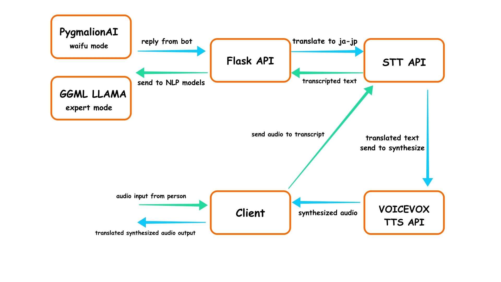

#  WaifuGPT
##  prequisities
- python >=3.8
- cuda ==11.7
- pytorch with cuda ==11.7 compatible
##  Installations
###  Installing CoquiTTS
follow the exact tutorials how to install it.
[coqui-ai/TTS: 🐸💬 - a deep learning toolkit for Text-to-Speech, battle-tested in research and production (github.com)](https://github.com/coqui-ai/TTS)

## Project Architecture
